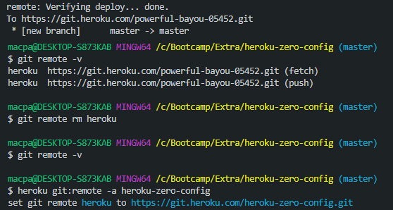

# How to Deploy a React App to Heroku with Zero Configuration

I love this! You can push a React App to Heroku and GitHub in 10 minutes.

## Deployed App
https://heroku-zero-config.herokuapp.com/

## Heroku Links

https://git.heroku.com/heroku-zero-config.gi

https://blog.heroku.com/deploying-react-with-zero-configuration

https://devcenter.heroku.com/articles/renaming-apps#updating-git-remotes

When you create the app this way you can rename it afterwards.

## Git Bash Commands

* `npm install -g create-react-app`
* `create-react-app my-app`
* `cd my-app`
* `git init`
* `heroku create -b https://github.com/mars/create-react-app-buildpack.git`
* `git add .`
* `git commit -m "react-create-app on Heroku"`
* `git push heroku master`
* `heroku open`

## Create Empty GitHub Repo

Create empty github repo and follow instructions to **push existing repository from the command line.**

(copy and paste this from the instructions when you create the repo)
* `git remote add origin git@github.com:MacParthum/YourAppName.git`
* `git branch -M main`
* `git push -u origin main`

## Commiting Changes Like Normal to GitHub and Heroku

* `git add -A`
* `git commit -m "Woo Hoo it's a React App deployed to Heroku and GitHub in 10 minutes"`
* `git push origin master`

* `git push heroku master`

